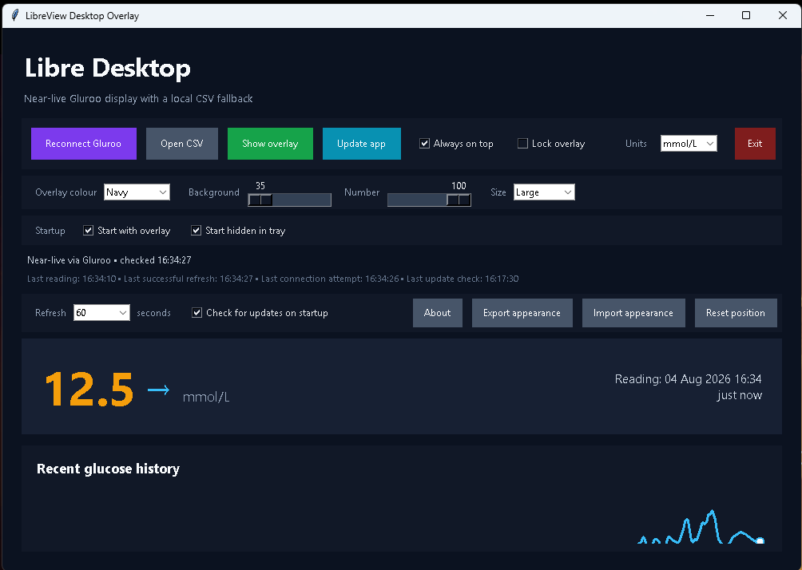
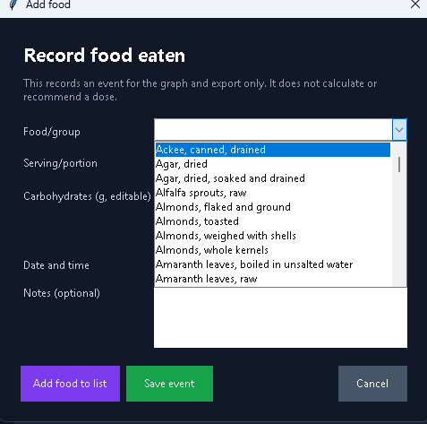
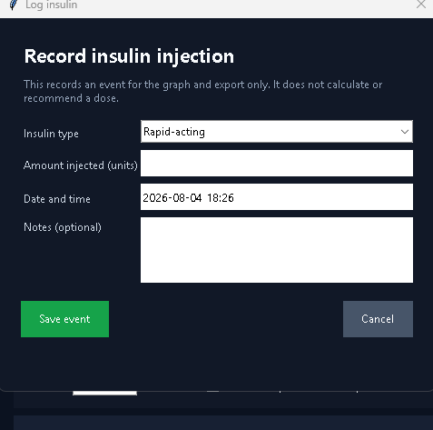
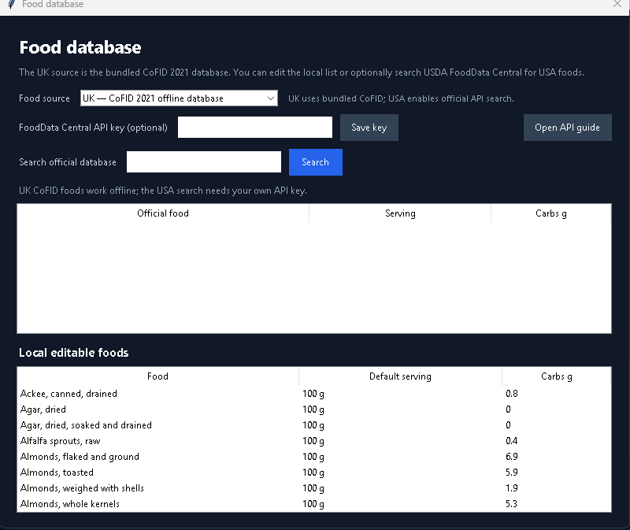
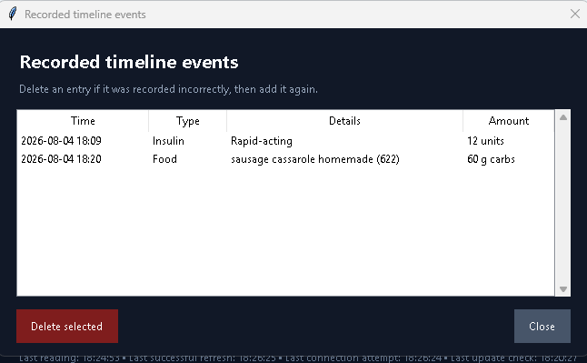

# Libre Desktop Overlay

A local Windows overlay for near-live FreeStyle Libre readings supplied by Gluroo. It refreshes every 30, 60, or 120 seconds, displays the reading timestamp and trend arrow, warns after five minutes without new data, and marks data stale after ten minutes.

This project is maintained at [github.com/lowey1212/libre-desktop-overlay](https://github.com/lowey1212/libre-desktop-overlay).

This project is available under the [Libre Desktop Overlay Free Use Licence](LICENSE). You may use, modify, and redistribute it, but the app and modified versions must remain free of charge and may not be sold.

## Recommended setup: Gluroo

Gluroo is the preferred custom-overlay source because it provides both a real-time web dashboard and an intentionally supported Nightscout-compatible connection. This avoids putting the LibreView password into the Windows program.

1. Install Gluroo on the phone and sign in.
2. In Gluroo, open **Menu → Settings → CGM**, select **Libre**, and connect LibreLinkUp using the appropriate Libre account/connection.
3. Open **Menu → Settings → Gluroo Global Connect Nightscout** and copy the URL/token/header details. The overlay accepts either a complete link or the JSON-style block Gluroo provides.
4. Double-click **Start LibreView Overlay.bat** on the PC.
5. Select **Connect Gluroo**, paste the URL, and connect.
6. Select the remember option if the overlay should reconnect automatically. The URL/token is then stored in Windows Credential Manager, not in a file.

If an always-on-top overlay is unnecessary, Gluroo already provides real-time monitoring dashboards at [app.gluroo.com](https://app.gluroo.com/). It uses the same Google or Apple login as the Gluroo phone app. Gluroo documents both the web dashboard and Libre support in its [official FAQ](https://gluroo.com/support/faqs/).

## Overlay controls

- **Show overlay** turns the floating reading on immediately. Use the overlay’s **×** control to close the entire application.
- **Update app** checks the public GitHub Releases page and offers to download the latest installer.
- The app can check for updates automatically when it starts. Disable **Check for updates on startup** if preferred.
- **About** shows the installed version and opens the official release page.
- Choose a background colour, background opacity, and number opacity independently, from 35% to fully opaque.
- **Always on top** keeps both overlay layers above other windows and is remembered between launches.
- The overlay can be dragged from anywhere on it. Enable **Lock overlay** to prevent accidental movement.
- Its screen position is saved and restored automatically. If monitors or DPI settings change, the overlay is brought back onto the visible virtual desktop. Use **Reset position** if needed.
- Use **Export appearance** and **Import appearance** to move visual preferences between PCs. These files contain no Gluroo URL, token, header, or other connection credentials.
- The main window shows the last reading, successful refresh, connection attempt, update check, and any current connection error.
- Choose a **Refresh** interval of 30, 60, or 120 seconds. The setting applies to the Gluroo polling and CSV file watcher.
- Under **Startup**, enable **Start with overlay** and **Start hidden in tray** to launch directly into the floating reading without showing the main window. Enable **Start with Windows** to launch the app automatically when you sign in to Windows; it applies only to your Windows user account and does not require administrator access.
- Choose Small, Medium, or Large overlay sizing.
- Minimizing or closing the main window hides it in the Windows notification area (hidden tray icons); the overlay continues running. Double-click the tray icon or choose **Show main window** to bring it back. Use **Exit** from the tray menu when you want to close everything completely.
- The overlay has no Windows title bar. Use **—** to hide it temporarily, or **×**/Escape to close the entire application.

## Screenshots

The main window shows the near-live reading, overlay controls, timeline controls, and glucose graph. Event markers can be hovered to show their recorded details.



The **Add food** dialog searches the UK CoFID database as you type. Select a result to fill the serving and carbohydrates, or use **Add food to list** for a new food.










## Timeline events and exports

- **Add food** records what was eaten, serving/portion, carbohydrates, time, and notes.
- **Log insulin** records insulin type, injected units, time, and notes. It never calculates or recommends a dose.
- Food and insulin events appear as markers on the recent glucose graph and can be reviewed under **Manage events**.
- **Export data** produces CSV or JSON containing timestamped glucose readings alongside timestamped food and insulin events for review with a GP, nurse, or official medical software.
- **Add food to list** lets you enter a food that is not found, add its serving and carbohydrate values to the local database, and reuse it in future entries.
- **Food database** defaults to the bundled UK [CoFID 2021 dataset](https://www.gov.uk/government/publications/composition-of-foods-integrated-dataset-cofid), with 2,853 searchable food entries and carbohydrate values per 100 g. You can add, edit, or delete local foods and serving estimates. The USA option can search the official [USDA FoodData Central API](https://fdc.nal.usda.gov/api-guide/) using your own API key, which is stored in Windows Credential Manager and never included in the build.
- Common-food values are estimates. Check packaged-food labels and adjust the serving/carbohydrate value before saving an event. The app does not use these records to advise treatment.


## Why the app does not log directly into LibreView

LibreView's reports page is designed for historical review, not guaranteed live monitoring. Abbott does not publish a stable consumer API for this use, and direct community clients rely on undocumented LibreLinkUp endpoints that can change without notice. The researched Gluroo feed is the lower-maintenance route for this overlay.

For the lowest possible latency without a custom overlay, mirror the official Libre phone app with Microsoft Phone Link on supported Android phones. That displays exactly what the phone sees and does not give the PC any glucose-service credentials.

## CSV fallback

Select **Open CSV** to display a LibreView export. The selected file is checked for changes using the selected refresh interval. CSV data is only as current as the export itself.

## Running and testing

Python 3.11 or newer is required. Double-click **Start LibreView Overlay.bat** to launch the app without leaving a command window open. The launcher installs the packages in `requirements.txt` when needed. If installation fails, Windows displays a brief error message.

To run the automated checks:

```powershell
python -m unittest -v
```

## Building a portable app

Run `build_windows.ps1` on Windows to create `standalone\LibreDesktopOverlay.exe` and, when Inno Setup is installed, `standalone\LibreDesktopOverlay-Setup.exe`. The executable contains Python and the required libraries, so it can be copied to another Windows PC and double-clicked directly. The build also places the project licence in the standalone folder, and the installer displays and installs it. The installer adds Start-menu and desktop shortcuts. The app stores each user’s settings and Windows Credential Manager secret in that user’s profile.

See `standalone\README - Install.txt` for the end-user installation instructions.

Additional project documentation is in [`docs/`](docs/): [installation](docs/INSTALLATION.md), [releases and updates](docs/UPDATES.md), [development](docs/DEVELOPMENT.md), and [security](docs/SECURITY.md).

## Privacy and safety

- LibreView and Gluroo account passwords are never requested by this Windows program.
- Gluroo access URLs are never written to project files or logs.
- Remembered secrets use Windows Credential Manager through the `keyring` package.
- Glucose traffic goes directly from this PC to the selected provider; no additional server is used by this project.
- This overlay is a convenience display. Verify readings in the official Libre app before treatment decisions, especially when data is stale or does not match symptoms.
- Timeline exports are records for discussion and review; they are not insulin instructions or a medical calculation.

## Licence

Libre Desktop Overlay is released under the [Libre Desktop Overlay Free Use Licence](LICENSE). It permits use, modification, and redistribution, but prohibits selling the app or charging for access to the app or modified versions. Because of that restriction, it is a custom licence rather than an OSI-approved open-source licence.
